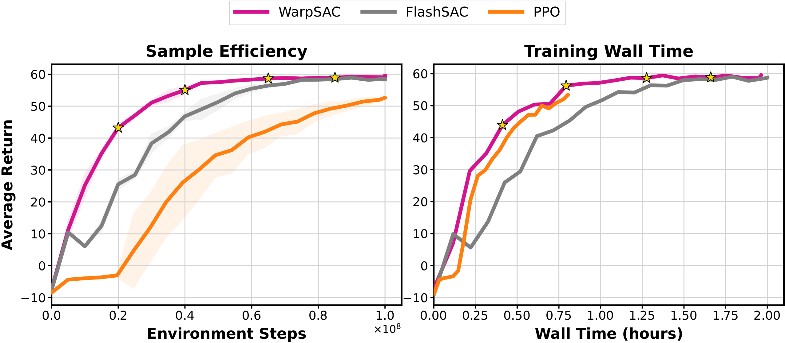
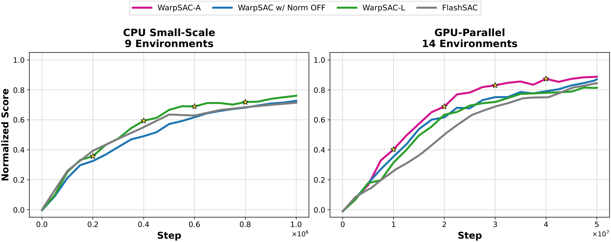
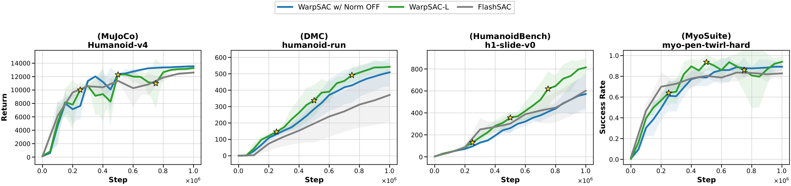
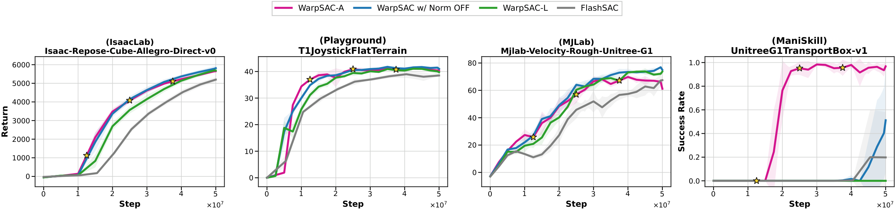
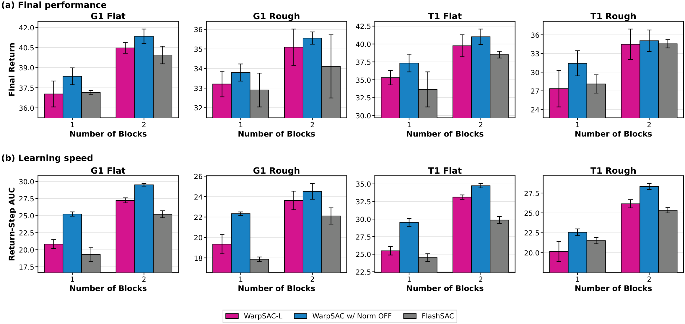
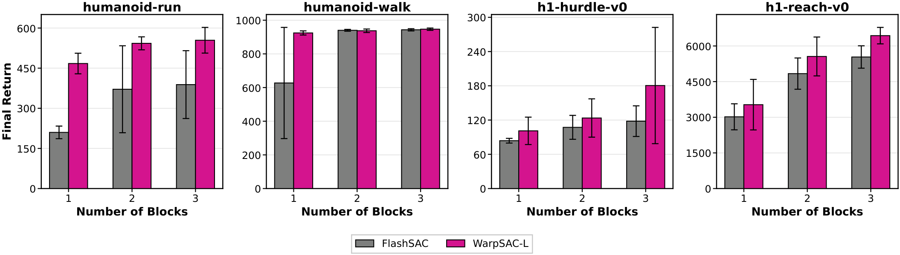

::: dark-mode
:::

::: nav
[<i class="fas fa-home" aria-hidden="true"></i>](./)
[Results](#results)
[Getting started](#getting-started)
[Citation](#citation)
:::

# WarpSAC: Towards the Pinnacle of Scalable Off-Policy RL by Rethinking Exploration and Exploitation

::: author
Zihao Wu^1^, Hongyao Tang^1^, Yi Ma^2^, Huizhong Song^2^, Pengyi Li^1^, Yifu Yuan^1^, Fei Ni^3^, Jinyi Liu^1^, Wei Wei^2^, Jianrong Wang^1^, Yan Zheng^1^, and Jianye Hao^1^
:::

::: institution
^1^Tianjin University · ^2^Shanxi University · ^3^Imperial College London
:::

::: button
[<i class="fa fa-file-pdf-o" aria-hidden="true"></i> Paper](assets/warpsac-paper.pdf)
[<i class="fa fa-youtube-play" aria-hidden="true"></i> Demo](#demo)
[<i class="fa fa-github" aria-hidden="true"></i> Code](https://github.com/wzhhasadream/warprl)
[<i class="fa fa-chart-bar" aria-hidden="true"></i> Results](#results)
:::

## Demo

::: row
@[video](assets/mp4/warpsac.mp4)
(a) WarpSAC on Unitree G1 Flat after approximately 35 minutes of training.

@[video](assets/mp4/flashsac.mp4)
(b) FlashSAC on Unitree G1 Flat after approximately 55 minutes of training.
:::


## Abstract

WarpSAC is an off-policy reinforcement-learning framework for both CPU-scale and GPU-parallel simulation. It provides JAX and PyTorch backends and supports continuous-control benchmarks spanning MuJoCo, IsaacLab, MJLab, ManiSkill, and related suites.

Our implementation examines how exploration, replay prioritization, parameter normalization, and scalable updates behave across CPU-scale and GPU-parallel training settings.



::: caption
**Figure 1.** Unitree G1 Flat learning curves measured by environment steps and training wall-clock time. WarpSAC reaches strong performance with fewer environment steps and less wall time than FlashSAC.
:::

## Method

WarpSAC is a controlled extension of FlashSAC that separates replay-side exploitation from network-side stabilization. Its main replay component, **Sample Weight Decay (SWD)**, assigns each transition an age-dependent sampling weight. Recent, policy-relevant data are sampled more often, while older transitions retain a nonzero weight for coverage. SWD changes only the minibatch distribution; it introduces no auxiliary network, Bellman target, or loss term.

Parameter projection normalization is the profile-level distinction between the two workload settings. It renormalizes network parameters after each optimizer step, constraining the effective function class and reducing unstable value extrapolation. WarpSAC-L enables normalization for CPU-scale training, while WarpSAC-A disables it for GPU-parallel training. Both profiles use the same SWD replay mechanism; the profiles do not represent different replay buffers or different state-action-pair coverage assumptions.

| Profile | Configuration |
| --- | --- |
| **WarpSAC-L** | CPU-scale profile: SWD, Norm ON, clipped double-Q |
| **WarpSAC-A** | GPU-parallel profile: SWD, Norm OFF, single-Q |
| **Automatic profiles** | Defaults are resolved from the environment type and workload scale |




::: caption
**Figure 2.** Combined CPU-scale and GPU-parallel learning curves. We recommend WarpSAC-L for CPU-scale training and WarpSAC-A for GPU-parallel training.
:::

## Results

### CPU-Scale vs. GPU-Parallel

CPU-scale and GPU-parallel workloads use the same SWD replay mechanism; the profile distinction here is parameter normalization. We therefore report them separately, using WarpSAC-L with normalization enabled for CPU-scale environments and WarpSAC-A with normalization disabled for GPU-parallel environments.



::: caption
**Figure 3.** CPU-scale learning curves across MuJoCo, DMC, HumanoidBench, and MyoSuite. WarpSAC-L is evaluated with parameter normalization enabled.
:::

The following results evaluate WarpSAC-A with parameter normalization disabled in IsaacLab, ManiSkill, MJLab, and Playground.



::: caption
**Figure 4.** GPU-parallel learning curves across IsaacLab, ManiSkill, MJLab, and Playground. WarpSAC-A is evaluated with parameter normalization disabled.
:::

### Normalization × Network Capacity

We next examine how the profile-dependent normalization choice interacts with network capacity. The ablations below cover GPU-parallel Playground training and CPU-scale training separately.



::: caption
**Figure 5.** Playground network-capacity ablation comparing WarpSAC variants and FlashSAC in GPU-parallel training.
:::

The CPU-scale ablation evaluates the corresponding WarpSAC-L configuration with parameter normalization enabled.



::: caption
**Figure 6.** CPU-scale network-capacity ablation comparing WarpSAC-L and FlashSAC.
:::

## Task Demo Videos


::: row
@[video](assets/mp4/Unitree-A2-Flat.mp4)
Unitree A2 Flat locomotion.
@[video](assets/mp4/Unitree-G1-Flat.mp4)
Unitree G1 Flat locomotion.
:::


::: row
@[video](assets/mp4/Unitree-Go2-Flat.mp4)
Unitree Go2 Flat locomotion.

@[video](assets/mp4/Unitree-H1_2-Flat.mp4)
Unitree H1-2 Flat locomotion.
:::


## Getting started

We provide an easy-to-use implementation of **WarpSAC** for scalable off-policy reinforcement-learning research in robotics. The codebase supports JAX and PyTorch backends, automatic environment-specific configuration, CPU and CUDA replay, and the Unitree G1 MJLab sim-to-real setup.

Please visit the [WarpSAC GitHub repository](https://github.com/wzhhasadream/warprl) for installation instructions, training commands, environment integrations, and configuration options.

## Citation

Use the following entry when citing the project. Update the author and venue fields when the paper metadata is final.

```bibtex
@article{warpsac,
  title  = {WarpSAC: Towards the Pinnacle of Scalable Off-Policy Reinforcement Learning},
  author = {Wu, Zihao and Tang, Hongyao and Ma, Yi and Song, Huizhong and Li, Pengyi and Yuan, Yifu and Ni, Fei and Liu, Jinyi and Wei, Wei and Wang, Jianrong and Zheng, Yan and Hao, Jianye},
  year   = {2026}
}
```
